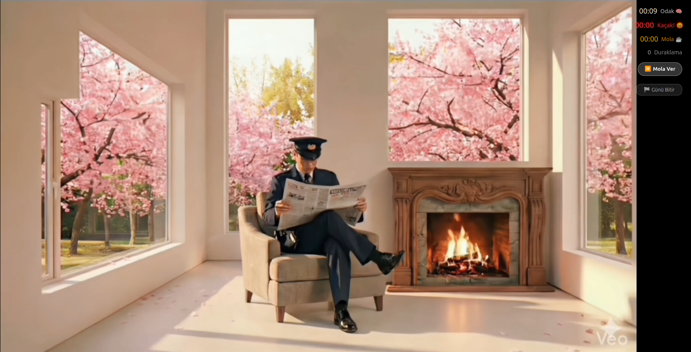
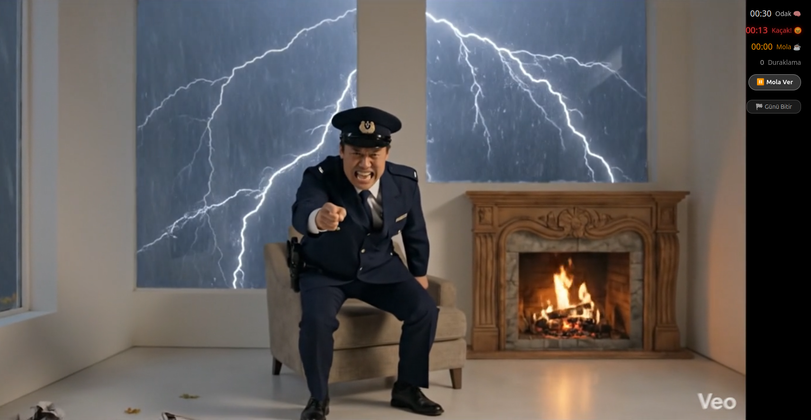
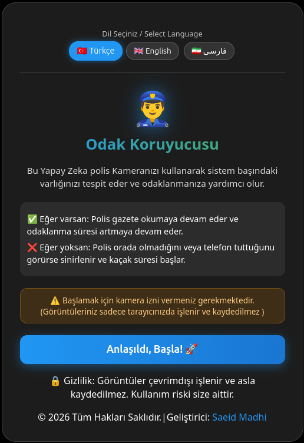
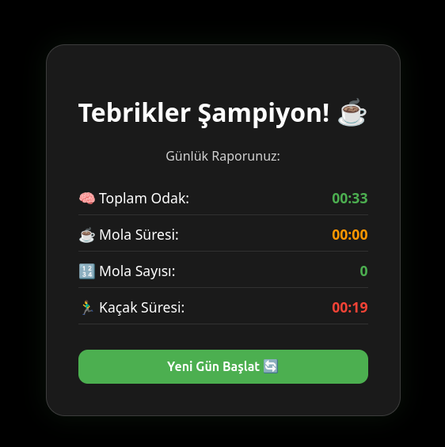

# 👮‍♂️ Focus Guardian | AI-Powered Productivity Assistant

> ⚠️ **Note:** The source code for this project is kept **Private** to protect custom detection algorithms and intellectual property. This repository serves as a technical portfolio piece.

🔗 **[Live Demo: Try Focus Guardian Here](https://focus-guardian-zeta.vercel.app/)**

## 📌 Overview
Focus Guardian is a web-based, real-time focus tracking application. It acts as a strict digital supervisor, using in-browser Artificial Intelligence (Computer Vision) to ensure users stay at their desks and avoid distractions during deep work sessions. By leveraging TensorFlow.js, the application processes the webcam feed entirely offline, ensuring absolute user privacy.

## ✨ Core Features
* **100% Privacy-First:** Local processing guarantees that camera data never leaves the user's device. Zero images or data are transmitted to any server.
* **Smart Distraction Recognition:** Actively monitors the webcam feed to detect if the user is absent or holding a mobile phone (`cell phone` detection).
* **Mathematical Bounding-Box Logic:** Calculates the overlap between the "Person" and "Phone" bounding boxes to differentiate between a phone lying safely on the desk versus one being actively held.
* **Multi-Language Support (i18n):** Fully localized interface supporting English, Persian (RTL), and Turkish.

## 💻 Tech Stack
* **Frontend:** React.js, Vite, CSS3
* **AI & Vision:** TensorFlow.js (`@tensorflow-models/coco-ssd`)
* **Hardware Integration:** `react-webcam` (for hidden, background video processing)
* **Deployment:** Vercel

## 📸 Preview

---
👨‍💻 **Developed by:** Saeid Madhilaleh
📧 Saeedmadhitabriz@gmail.com
